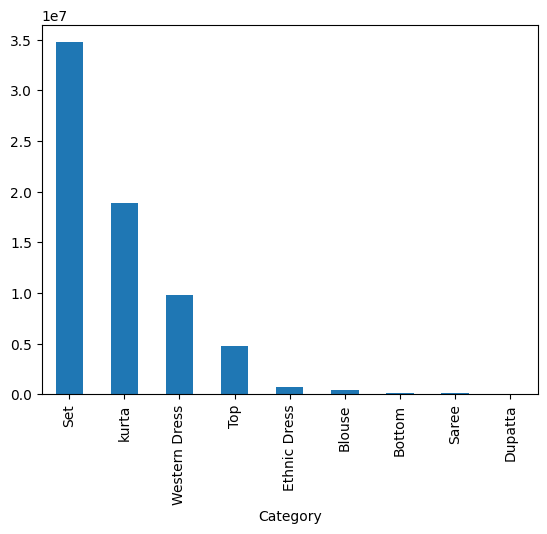

# ecommerce-sales-analysis
Analyse des données d'un ensemble de données de commerce électronique pour identifier les moteurs de revenus, les annulations et la performance logistique.
## Analyse des ventes par catégorie

Analyse des données d'un ensemble de données de commerce électronique pour identifier les moteurs de revenus, les annulations et la performance logistique.

## Analyse des ventes par catégorie

## Evolution des ventes par mois

